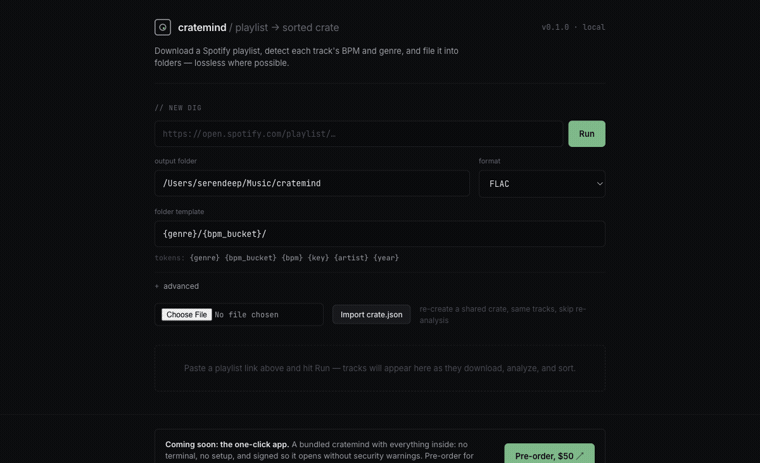

# cratemind

[](https://github.com/Serendeep/cratemind/actions/workflows/ci.yml)
[](https://github.com/Serendeep/cratemind/releases)
[](LICENSE)
[](pyproject.toml)

**Auto-sort any Spotify playlist into DJ-ready crates by genre and tempo.**

cratemind downloads each track, detects its BPM, key, and genre, and files it
into folders like `hard techno/140-147/`. Built for DJs and crate-diggers who
want a library sorted the way they mix. The audio is downloaded and analyzed on
your own machine, with no account to sign up for.

<p align="center">
  
</p>

## Contents

- [What it does](#what-it-does) · [What you get](#what-you-get)
- [Install](#install-one-command) · [Manual setup](#manual-setup) · [Run it](#run-it) · [Using it](#using-it)
- [Genre detection](#genre-detection-audio-model) · [Sharing a crate](#sharing-a-crate) · [Audio quality](#audio-quality)
- [Troubleshooting](#troubleshooting) · [Roadmap](#roadmap) · [Contributing](#contributing)
- [Reporting bugs](#reporting-bugs) · [One-click app](#a-one-click-app-coming-soon) · [License](#license-and-disclaimer)

## What it does

- **Downloads a whole Spotify playlist** with spotdl, in the format you pick.
- **Detects BPM and Camelot key** for every track, for tempo sorting and
  harmonic mixing.
- **Identifies the genre from the audio.** An on-device model reads the real
  electronic sub-genre (hard techno, tech house, trance) straight off the
  waveform, since underground tracks rarely carry a usable genre tag.
- **Sorts into folders you template**, like `hard techno/140-147/`.
- **Live progress in the browser**, and reloading the page reconnects to the run.
- **Resumes instantly**, re-running a playlist skips tracks already sorted.
- **Share a crate** as a small `crate.json` (the analysis, not the audio) and
  re-import it to rebuild the same folders without re-analyzing.
- **Runs on your own machine.** No account, and by default nothing about your
  tracks leaves it. You can opt into a Deezer genre lookup that sends only the
  track name.

## What you get

```
~/Music/cratemind/
├── hard techno/
│   ├── 140-147/
│   └── 148-155/
├── techno/
│   └── 132-139/
└── tech house/
    └── 124-131/
```

Each track lands in a `{genre}/{tempo}/` folder. When the model isn't confident
and no genre can be found, the track is grouped by artist instead; never lost.

---

## Install (one command)

One line installs everything — uv, spotdl, ffmpeg, and cratemind itself as a
global `cratemind` command. It pulls the latest release and asks whether to set
up the genre model:

- macOS / Linux:
  ```
  curl -fsSL https://raw.githubusercontent.com/Serendeep/cratemind/main/install.sh | sh
  ```
- Windows (PowerShell):
  ```
  powershell -ExecutionPolicy ByPass -c "irm https://raw.githubusercontent.com/Serendeep/cratemind/main/install.ps1 | iex"
  ```

Anything already installed is left alone. When it finishes, open a new terminal
and run `cratemind`. Prefer to install by hand? See [Manual setup](#manual-setup)
below.

Piped through `sh`/`iex` the installer can't prompt, so it takes the defaults —
that **includes the ~330 MB genre model**. To run it interactively (and choose),
download `install.sh` first and run it, or pass `--yes`/`-Yes` to confirm you
want every default up front.

If no system ffmpeg is found, the installer fetches a portable copy through
spotdl; the app adds it to its own PATH at startup, so you never touch
environment variables.

### Updating

```
cratemind update
```

It checks the latest [GitHub release](https://github.com/Serendeep/cratemind/releases)
and, if there's a newer one, reinstalls cratemind from it. cratemind also says on
startup when a new version is out. The ~330 MB genre model and ffmpeg live in your
user cache, so an update reuses them instead of downloading them again — only the
app itself is rebuilt. Re-running the installer does the same thing.

---

## Manual setup

Only needed if the setup script missed something, or you'd rather do it yourself.
cratemind relies on three free tools; install each once.

**1. uv**: runs cratemind

- macOS / Linux:
  ```
  curl -LsSf https://astral.sh/uv/install.sh | sh
  ```
- Windows (PowerShell):
  ```
  powershell -ExecutionPolicy ByPass -c "irm https://astral.sh/uv/install.ps1 | iex"
  ```

**2. spotdl**: fetches the tracks

```
uv tool install --force --python 3.12 spotdl
```

Pin Python 3.12 — on newer interpreters spotdl's dependencies fail with an
"openssl outdated" error.

**3. ffmpeg**: handles the audio

- macOS (Homebrew): `brew install ffmpeg`
- Windows (winget): `winget install Gyan.FFmpeg`
- Linux (apt): `sudo apt install ffmpeg`

No system package manager? Install cratemind first (next step), then fetch a
portable build into its cache with `cratemind setup-ffmpeg`. The app finds it
automatically — no PATH changes needed.

**4. cratemind**: the app itself, as a global command

```
uv tool install "cratemind[audio-genre] @ git+https://github.com/Serendeep/cratemind@v0.3.0"
uv tool update-shell
```

Replace the tag with the latest from the
[releases page](https://github.com/Serendeep/cratemind/releases). Drop
`[audio-genre]` if you don't want the genre model. `uv tool update-shell` puts
the `cratemind` command on your PATH.

---

## Run it

```
cratemind
```

(Installed from a clone instead? Run `uv run cratemind` from the project folder.)

The first run takes a minute while uv sets things up. When it's ready it prints a
link. Open `http://127.0.0.1:8000` in your browser. Paste a playlist link, pick
a folder, and hit **Run**.

---

## Using it

- **Output folder**: where your sorted music lands. Defaults to
  `~/Music/cratemind`.
- **Format**: FLAC (best quality) by default; MP3 and M4A are smaller.
- **Folder template**: how folders get named. `{genre}/{bpm_bucket}/` gives you
  `hard techno/140-147/`. You can mix and match these tokens: `{genre}`,
  `{bpm_bucket}`, `{bpm}`, `{key}`, `{artist}`, `{year}`. `{key}` is the Camelot
  code (like `8A`) for harmonic mixing, also shown next to each track's BPM.
- **Advanced**: the BPM window (used to correct half- or double-tempo
  mistakes), how wide each tempo band is, and **metadata tags** (below).

### Metadata tags (for Rekordbox, Mixxx, Serato…)

cratemind writes the **key, BPM, and genre** into each downloaded file's tags so
DJ software shows them on import. It's on by default — uncheck it under Advanced
to leave files untouched.

The key is written as the **Camelot code** (`8A`) by default, which most DJ
software reads. Two notes:

- **Mixxx** expects *musical* notation (`Am`) in the key field. Switch the "key
  as" option under Advanced to **musical** if you use Mixxx.
- **Rekordbox** runs its own key analysis on import, which can override the
  embedded value. To keep cratemind's key, disable Key under
  Preferences → Analysis, or use *Reload Tags*.

Tracks appear in a live list as they download, get analyzed, and get sorted. When
no genre can be found for a track, it's grouped by artist instead; never lost.

**Genre aliases**: the [`/settings`](http://127.0.0.1:8000/settings) page lets you
fold different names for the same genre into one folder — e.g. map `tech house`
to `house` so they don't split into separate folders. A handful of aliases
(`dnb` → `drum and bass`, etc.) are built in; your own are applied on top.

Re-running a playlist is cheap: each track is downloaded straight into your output
folder and moved into its genre folder, so a re-run skips everything that's
already sorted and only fetches what's new.

---

## Genre detection (audio model)

cratemind reads the genre from the audio with an on-device model, so it works on
underground tracks that have no genre tag. The model is an optional ~330 MB
download; the installer offers to fetch it. Already installed without it? Re-run
the installer and choose yes, or from a clone:

```
uv sync --extra audio-genre
uv run cratemind download-model
```

Without it, cratemind groups tracks by artist. The model runs locally on the CPU.
You can also opt into a coarse Deezer lookup (off by default, a checkbox under
**advanced**) for the tail the model misses; it sends only the track's name,
never the audio.

---

## Sharing a crate

You can export a crate as a small `crate.json` file. It holds the analysis,
genre and BPM per track, not the audio. Someone else can import it to rebuild
the same sorted folders without re-analyzing anything. You can also upload it to
a free host (catbox.moe or 0x0.st) to get a link you can pass around.

---

## Audio quality

cratemind downloads good-quality audio with spotdl in the format you pick (FLAC,
MP3, or M4A). True lossless from Tidal/Qobuz is paused for now; see the
[Roadmap](#roadmap).

---

## Troubleshooting

- **"spotdl is not installed"** (or an "openssl outdated" error): run
  `uv tool install --force --python 3.12 spotdl`.
- **"ffmpeg not found"**: run `cratemind setup-ffmpeg`, or re-run the installer —
  both fetch a portable ffmpeg the app picks up automatically.
- **A BPM looks wrong (half or double)**: widen or narrow the BPM window under
  Advanced so it matches the music you're sorting.

---

## Roadmap

See [docs/ROADMAP.md](docs/ROADMAP.md) for what's done, in progress, and planned.

One near-term item worth calling out: **true lossless downloads (Tidal/Qobuz
FLAC)**. This used
[SpotiFLAC](https://github.com/ShuShuzinhuu/SpotiFLAC-Module-Version)'s free,
no-account providers, reverse-engineered mirrors that go down for hours at a
time. The integration and an automatic fallback to spotdl are already built;
it's disabled by default and explored on the `experiment/spotiflac-lossless`
branch. It'll come back on once it's dependable.

---

## Contributing

Pull requests are welcome. The quick version: `uv sync --extra dev`, make your
change with a test, then `uv run pytest && uv run ruff check src tests` before you
open a PR. Commits use [Conventional Commits](https://www.conventionalcommits.org/)
(`feat: …`, `fix: …`, `docs: …`) since releases are generated from them.

Good first issues: add a genre alias pack or a new folder-template token. See
[CONTRIBUTING.md](CONTRIBUTING.md) for the full setup, conventions, and release flow,
and the [roadmap](docs/ROADMAP.md) for what's planned.

---

## Reporting bugs

Open an issue on the [GitHub Issues page](https://github.com/Serendeep/cratemind/issues) and include:

- What you did: your format and template settings, and the playlist link if
  it's public.
- What you expected versus what actually happened.
- The error message, copied from the terminal.
- Your operating system and tool versions:
  ```
  uv --version
  ffmpeg -version
  spotdl --version
  ```

The more of that you include, the faster it gets fixed. For anything
security-sensitive, please contact the maintainer privately instead of opening a
public issue.

---

## A one-click app (coming soon)

A bundled version with everything inside (no terminal, no setup), code-signed so
it opens without security warnings, is planned for desktop. Pre-order for $50 to
lock in the early-supporter price and get it the day it ships. Look for the
pre-order link in the app footer, or [buy me a coffee](https://buymeacoffee.com/serendeep).

---

## Support

If cratemind saved you some time, you can
[buy me a coffee](https://buymeacoffee.com/serendeep). No pressure, it's free
either way.

---

## License and disclaimer

MIT. See [LICENSE](LICENSE).

Please read the [DISCLAIMER](DISCLAIMER.md). In short: cratemind is for
organizing music you're entitled to use, and you're responsible for following
Spotify's terms and copyright law where you live. It isn't affiliated with
Spotify or any other service.
